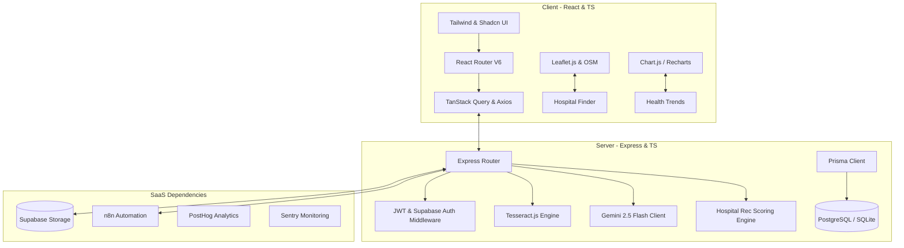

# PULSE — AI-powered Healthcare Navigation & Medical Report Understanding

Pulse is a production-grade SaaS platform designed to bridge the gap between complex health data and clear, actionable patient understanding. It facilitates hospital discovery, provider comparison, prescription clarification, and medical report translation into consumer-friendly language, all while upholding the highest standards of safety, privacy, and visual excellence.

---

## User Review Required

Before starting, please review the proposed architecture and integration choices:

> [!IMPORTANT]
> **Dual Database & Storage Strategy for Instant Local Dev**
> To allow you to run and preview the application immediately without requiring a pre-configured PostgreSQL database, Supabase Auth client, or active Gemini API billing keys, we are implementing a **Dual Mode Engine** in the backend:
> 1. **Production Mode**: Connects to PostgreSQL, Supabase Auth, Supabase Storage, and the live Google Gemini API.
> 2. **Local/Demo Mode**: Gracefully falls back to SQLite, local directory-based file storage, a simulated secure JWT Auth system, and a robust mock-AI engine generating realistic clinical data.
> This ensures a **zero-config immediate run** while preserving production-ready code.

> [!WARNING]
> **AI Safety Guidelines**
> To satisfy healthcare compliance and medical safety, all Gemini-driven endpoints strictly sanitize and validate inputs, output clear liability disclaimers, and *never* provide diagnostic labels, treatment plans, or prescription recommendations.

---

## Technical Stack & Architecture

Pulse uses a multi-layered fullstack architecture, split into `frontend` and `backend` workspaces.



---

## Database Schema (Prisma)

Here is our relational model design mapped out for Prisma, covering all required features including search history, saved hospitals, and granular OCR values.

```prisma
datasource db {
  provider = "sqlite" // Configured for local sqlite for instant zero-config dev
  url      = "file:./dev.db"
}

generator client {
  provider = "prisma-client-js"
}

enum Role {
  GUEST
  USER
  ADMIN
}

enum NotificationType {
  INFO
  WARNING
  SUCCESS
}

enum ReportType {
  CBC
  HBA1C
  THYROID
  LIPID
  LFT
  KFT
  VITAMIN
  GENERAL
}

enum Status {
  PENDING
  OCR_COMPLETED
  ANALYZED
  FAILED
}

model User {
  id              String           @id @default(uuid())
  email           String           @unique
  passwordHash    String
  name            String
  role            String           @default("USER") // GUEST, USER, ADMIN
  createdAt       DateTime         @default(now())
  updatedAt       DateTime         @updatedAt
  
  reviews         HospitalReview[]
  savedHospitals  SavedHospital[]
  searchHistories SearchHistory[]
  recommendations Recommendation[]
  prescriptions   Prescription[]
  medicalReports  MedicalReport[]
  healthInsights  HealthInsight[]
  healthTrends    HealthTrend[]
  adminLogs       AdminLog[]
  aiUsages        AIUsage[]
  notifications   Notification[]
}

model Hospital {
  id                  String             @id @default(uuid())
  name                String
  address             String
  latitude            Float
  longitude           Float
  rating              Float              @default(0.0)
  phone               String?
  email               String?
  website             String?
  workingHours        String
  emergencyAvailable  Boolean            @default(false)
  recommendationScore Float              @default(0.0)
  createdAt           DateTime           @default(now())
  
  reviews             HospitalReview[]
  savedBy             SavedHospital[]
  specialties         HospitalSpecialty[]
  recommendations     Recommendation[]
}

model Specialty {
  id          String              @id @default(uuid())
  name        String              @unique
  description String
  category    String
  createdAt   DateTime            @default(now())
  
  hospitals   HospitalSpecialty[]
}

model HospitalSpecialty {
  hospitalId   String
  specialtyId  String
  departments  String // Comma separated specific departments
  averageCost  Float  @default(0.0)
  
  hospital     Hospital  @relation(fields: [hospitalId], references: [id], onDelete: Cascade)
  specialty    Specialty @relation(fields: [specialtyId], references: [id], onDelete: Cascade)

  @@id([hospitalId, specialtyId])
}

model HospitalReview {
  id         String   @id @default(uuid())
  hospitalId String
  userId     String
  rating     Int
  reviewText String
  createdAt  DateTime @default(now())
  
  hospital   Hospital @relation(fields: [hospitalId], references: [id], onDelete: Cascade)
  user       User     @relation(fields: [userId], references: [id], onDelete: Cascade)
}

model SavedHospital {
  id         String   @id @default(uuid())
  userId     String
  hospitalId String
  createdAt  DateTime @default(now())
  
  user       User     @relation(fields: [userId], references: [id], onDelete: Cascade)
  hospital   Hospital @relation(fields: [hospitalId], references: [id], onDelete: Cascade)

  @@unique([userId, hospitalId])
}

model SearchHistory {
  id        String   @id @default(uuid())
  userId    String
  query     String
  category  String
  createdAt DateTime @default(now())
  
  user      User      @relation(fields: [userId], references: [id], onDelete: Cascade)
}

model Recommendation {
  id                 String   @id @default(uuid())
  userId             String
  hospitalId         String
  specialtyMatchScore Float
  distanceScore      Float
  ratingScore        Float
  availabilityScore  Float
  totalScore         Float
  explanation        String
  createdAt          DateTime @default(now())
  
  user               User     @relation(fields: [userId], references: [id], onDelete: Cascade)
  hospital           Hospital @relation(fields: [hospitalId], references: [id], onDelete: Cascade)
}

model Prescription {
  id                   String                 @id @default(uuid())
  userId               String
  fileUrl              String
  rawText              String?
  status               String                 @default("PENDING") // PENDING, OCR_COMPLETED, ANALYZED
  createdAt            DateTime               @default(now())
  
  user                 User                   @relation(fields: [userId], references: [id], onDelete: Cascade)
  ocrResult            OCRResult?
  prescriptionAnalysis PrescriptionAnalysis[]
}

model MedicalReport {
  id             String                     @id @default(uuid())
  userId         String
  fileUrl        String
  reportType     String                     @default("GENERAL") // CBC, HBA1C, THYROID, LIPID, LFT, KFT, VITAMIN, GENERAL
  rawText        String?
  status         String                     @default("PENDING")
  reportDate     DateTime                   @default(now())
  createdAt      DateTime                   @default(now())
  
  user           User                       @relation(fields: [userId], references: [id], onDelete: Cascade)
  ocrResult      OCRResult?
  values         MedicalReportValue[]
  summary        MedicalReportSummary?
  specialists    SpecialistRecommendation[]
}

model OCRResult {
  id              String        @id @default(uuid())
  prescriptionId  String?       @unique
  medicalReportId String?       @unique
  rawText         String
  confidence      Float         @default(0.0)
  verifiedData    String?       // JSON string of corrected metrics
  verifiedAt      DateTime?
  
  prescription    Prescription? @relation(fields: [prescriptionId], references: [id], onDelete: Cascade)
  medicalReport   MedicalReport? @relation(fields: [medicalReportId], references: [id], onDelete: Cascade)
}

model PrescriptionAnalysis {
  id                   String       @id @default(uuid())
  prescriptionId       String
  medicineName         String
  dosage               String
  instructions         String
  simplifiedExplanation String
  sideEffects          String
  drugInteractions     String
  parsedAt             DateTime     @default(now())
  
  prescription         Prescription @relation(fields: [prescriptionId], references: [id], onDelete: Cascade)
}

model MedicalReportValue {
  id              String        @id @default(uuid())
  medicalReportId String
  key             String        // e.g. HbA1c, Hemoglobin
  value           Float
  unit            String
  referenceRange  String        // e.g. 12.0 - 15.0
  isAbnormal      Boolean       @default(false)
  description     String?
  category        String        // e.g. Thyroid, Lipid
  
  medicalReport   MedicalReport @relation(fields: [medicalReportId], references: [id], onDelete: Cascade)
}

model MedicalReportSummary {
  id                    String        @id @default(uuid())
  medicalReportId       String        @unique
  healthSummary         String
  normalFindingsCount   Int           @default(0)
  abnormalFindingsCount Int           @default(0)
  overallStatus         String        // e.g. STABLE, MONITOR, ATTENTION
  createdAt             DateTime      @default(now())
  
  medicalReport         MedicalReport @relation(fields: [medicalReportId], references: [id], onDelete: Cascade)
}

model HealthInsight {
  id             String   @id @default(uuid())
  userId         String
  title          String
  description    String
  category       String
  severity       String   // INFO, WARNING, DANGER
  actionRequired String?
  createdAt      DateTime @default(now())
  
  user           User     @relation(fields: [userId], references: [id], onDelete: Cascade)
}

model HealthTrend {
  id         String   @id @default(uuid())
  userId     String
  markerName String
  value      Float
  unit       String
  recordedAt DateTime
  
  user       User     @relation(fields: [userId], references: [id], onDelete: Cascade)
}

model SpecialistRecommendation {
  id                    String        @id @default(uuid())
  medicalReportId       String
  specialtyName         String
  confidenceScore       Float
  reason                String
  recommendedHospitalsJson String      // JSON serialized string of matched hospitals
  createdAt             DateTime      @default(now())
  
  medicalReport         MedicalReport @relation(fields: [medicalReportId], references: [id], onDelete: Cascade)
}

model AdminLog {
  id        String   @id @default(uuid())
  userId    String
  action    String
  details   String
  ipAddress String?
  createdAt DateTime @default(now())
  
  user      User     @relation(fields: [userId], references: [id], onDelete: Cascade)
}

model AIUsage {
  id          String   @id @default(uuid())
  userId      String
  feature     String
  tokensUsed  Int      @default(0)
  modelName   String   @default("Gemini 2.5 Flash")
  cost        Float    @default(0.0)
  processedAt DateTime @default(now())
  
  user        User     @relation(fields: [userId], references: [id], onDelete: Cascade)
}

model Notification {
  id        String   @id @default(uuid())
  userId    String
  title     String
  message   String
  type      String   @default("INFO") // INFO, WARNING, SUCCESS
  isRead    Boolean  @default(false)
  createdAt DateTime @default(now())
  
  user      User     @relation(fields: [userId], references: [id], onDelete: Cascade)
}
```

---

## MVP Work Phases & Development Order

We will build the system iteratively following your MVP roadmap, utilizing strict typing, full validation (Zod), rich styles, and thorough fallbacks.

### Phase 1: Authentication & Core Discovery
* **Files Affected**:
  * [NEW] `backend/src/routes/auth.ts`, `backend/src/routes/hospitals.ts`
  * [NEW] `frontend/src/pages/Landing.tsx`, `frontend/src/pages/Search.tsx`, `frontend/src/pages/HospitalDetail.tsx`
* **Features**:
  * User register, login, session validation.
  * Leaflet dynamic maps with real-time location filter, rating scorecards, and emergency buttons.
  * Seed 5+ detailed clinics & tertiary care hospitals.

### Phase 2: Recommendations & Comparison Panel
* **Files Affected**:
  * [NEW] `backend/src/services/recommendation.ts`
  * [NEW] `frontend/src/pages/Comparison.tsx`, `frontend/src/pages/SavedHospitals.tsx`
* **Features**:
  * Implement the matching engine score: `40% Specialty + 30% Distance + 20% Rating + 10% Emergency Availability`.
  * Multi-hospital layout showing Side-by-Side highlights of working hours, distances, departments, costs, and availability.

### Phase 3: Prescription OCR & AI Analyzer
* **Files Affected**:
  * [NEW] `backend/src/routes/prescriptions.ts`, `backend/src/services/ocr.ts`, `backend/src/services/ai.ts`
  * [NEW] `frontend/src/pages/PrescriptionCenter.tsx`
* **Features**:
  * Implement WebAssembly-powered `Tesseract.js` for zero-setup document scanning.
  * Dual-pane layout on Frontend: left is raw OCR output, right is live verification forms before committing.
  * Gemini prompt to breakdown schedules, dosage definitions, side effects, and warning tags.

### Phase 4: Medical Report Engine & Specialist Mapping
* **Files Affected**:
  * [NEW] `backend/src/routes/reports.ts`
  * [NEW] `frontend/src/pages/ReportCenter.tsx`
* **Features**:
  * Multi-metric parsing (HbA1c, Thyroid panel, Vitamin profile, CBC).
  * Specialist router mapping low ranges/abnormal markers (e.g. low hemoglobin -> Hematologist, low T3/T4 -> Endocrinologist).

### Phase 5: Health Trends & n8n Architecture
* **Files Affected**:
  * [NEW] `backend/src/routes/trends.ts`, `backend/src/routes/n8n.ts`
  * [NEW] `frontend/src/pages/HealthTrends.tsx`
* **Features**:
  * Render Interactive Multi-axis Recharts tracking lab markers over a timeline.
  * Provide complete n8n workflow configurations (JSON) representing Prescription automation, Weekly email newsletters, and system alerting hooks.

### Phase 6: Admin Center & Production Hardening
* **Files Affected**:
  * [NEW] `frontend/src/pages/AdminDashboard.tsx`
* **Features**:
  * Admin monitoring charts for API performance, OCR queues, and active Gemini tokens used.

---

## AI Prompt Strategies & Safety Systems

Pulse utilizes highly rigid prompt specifications to guarantee factual, non-diagnostic educational layouts.

### 1. Prescription Parsing Prompt
```text
Analyze this clinical prescription text: "${rawText}"
Parse it into structured JSON objects. Translate all short abbreviations (e.g. BD, TID, PRN, PO) to plain educational language.
Output format must be strictly:
{
  "medicines": [
    {
      "name": "Medicine Name",
      "dosage": "dosage detail",
      "instructions": "Detailed plain instructions (e.g. Take 1 tablet by mouth three times a day, after meals)",
      "simplifiedExplanation": "What this medication category is general used for",
      "sideEffects": "Common known side effects",
      "drugInteractions": "General warnings"
    }
  ]
}
NEVER offer clinical diagnostic assumptions or treatment modifications. Add the global safety disclaimer.
```

### 2. Lab Report Marker Extractor
```text
Extract metrics from this medical lab report text: "${rawText}"
Match values to CBC, HbA1c, Thyroid, Lipid, LFT, or KFT fields.
Output JSON format:
{
  "reportType": "CBC | HBA1C | THYROID | LIPID | LFT | KFT | GENERAL",
  "values": [
    { "key": "Marker name", "value": 12.5, "unit": "g/dL", "referenceRange": "12.0 - 15.0", "isAbnormal": false, "description": "Simple definition of this marker" }
  ],
  "summary": "Overall friendly high level review in layperson words.",
  "status": "STABLE | MONITOR | ATTENTION",
  "specialists": [
    { "specialtyName": "Endocrinologist", "confidenceScore": 0.95, "reason": "Due to elevated TSH values" }
  ]
}
Strictly do not output any disease diagnostic titles (e.g., do not say 'You have Hypothyroidism'). Focus exclusively on the chemistry parameters and general specialist routing.
```

---

## Automation Layer: n8n Workflow Exports

We will place production-ready, exportable JSONs inside `backend/n8n/` for the following pipelines:

1. **Prescription OCR Pipeline (`prescription_pipeline.json`)**: Listens to file hooks, runs OCR & Gemini, updates database entries, and delivers instant toast triggers.
2. **Lab Analysis & Hospital Referral Engine (`report_pipeline.json`)**: Runs multi-marker analysis, matches specialist categories, runs the Hospital Recommender API, and saves outcomes.
3. **Weekly Newsletter & Marker Tracker (`weekly_cron.json`)**: Triggers every Monday, aggregates user health records, uses Gemini to review trends, and fires off a notification.
4. **Admin Dashboard Monitoring Pipeline (`admin_alerting.json`)**: Feeds system exceptions and failed OCR hooks straight to alert channels.

---

## Visual Design System & Aesthetics

Pulse utilizes a modern glassmorphic look that feels extremely premium:
* **Backgrounds**: Soft dark backgrounds (`#0B0F19`) coupled with deep indigo gradients (`#0D6EFD`) and translucent cards (`backdrop-blur-md bg-white/5 border border-white/10`).
* **Fonts**: `Inter` or `Outfit` imported via Google Fonts for sleek readability.
* **Micro-interactions**: Scale transforms on hovering cards, loading glowing skeleton indicators, and smooth charts.

---

## Verification Plan

### Automated Verification
* Run frontend builds to verify all TypeScript types and bundler splits:
  `cd frontend && npm run build`
* Run Prisma schema compilations and DB migrations:
  `cd backend && npx prisma validate && npx prisma db push`
* Run ESLint and TypeScript checks across the backend:
  `cd backend && npx tsc --noEmit`

### Manual Verification
* Deploy a test environment locally, launch dev servers, and verify the multi-pane OCR screen, Leaflet maps, and Recharts trends.
